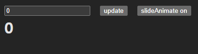

[Documentation - livemehere-dev-packs](https://livemehere.github.io/livemehere-dev-packs/docs/animate-number-react/what-is-this)

## Introduction

This is a React component that can animate number from one value to another.
Basically, 0 is the start value and children is the end value.(children must be a string or number)

## Features

- Animate number from 0 to children
- Animate number from previous children to children.(you can update)
- Support two types of animation : `slide` and `direct`.
- Customizable animation `duration`, `easing`, `format`, `separator`, `decimal`, `startVal` etc.
